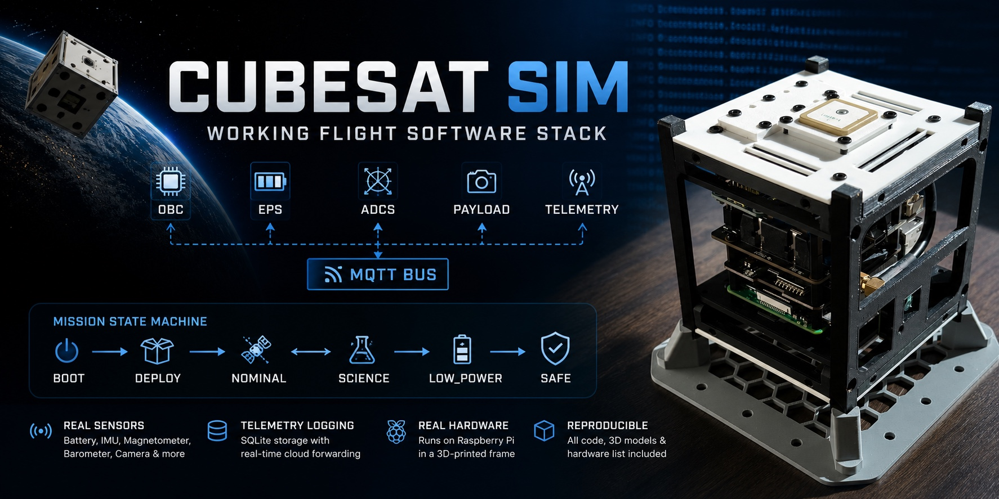
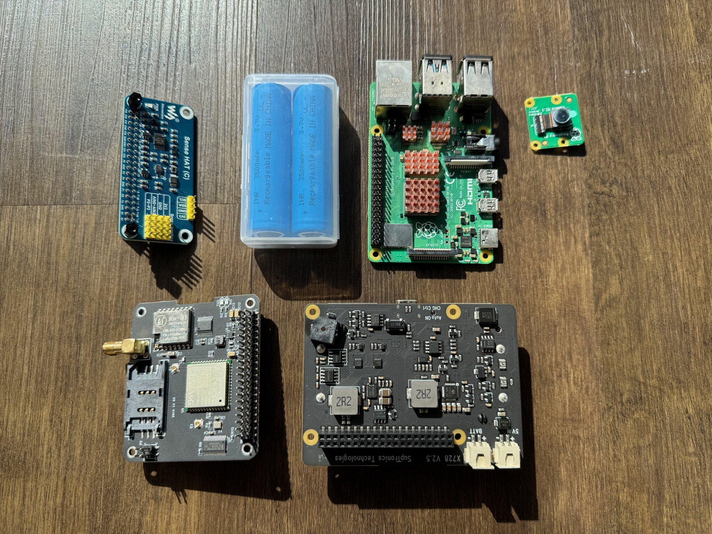
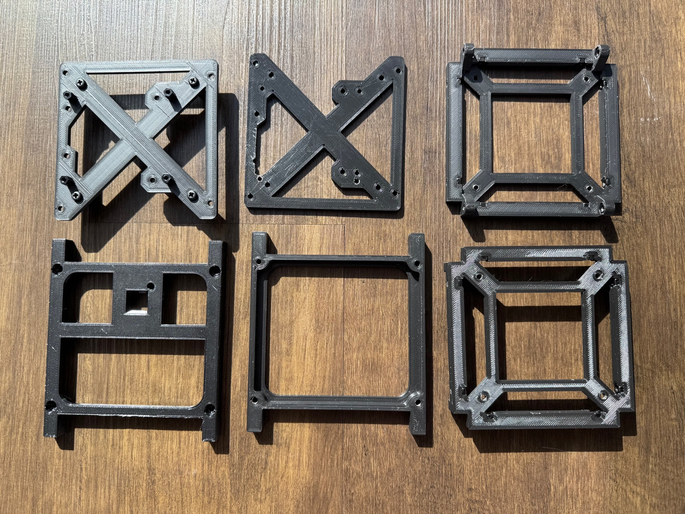
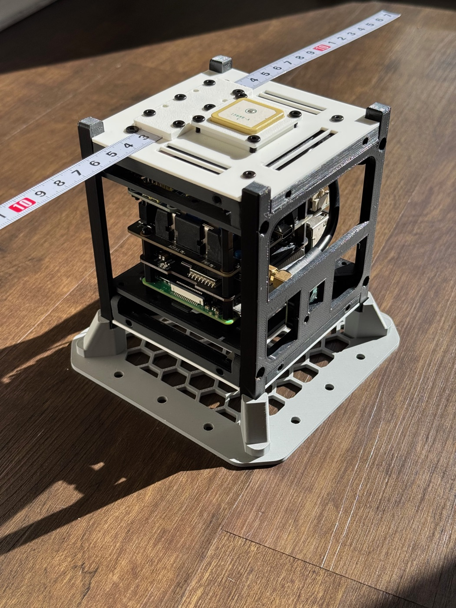
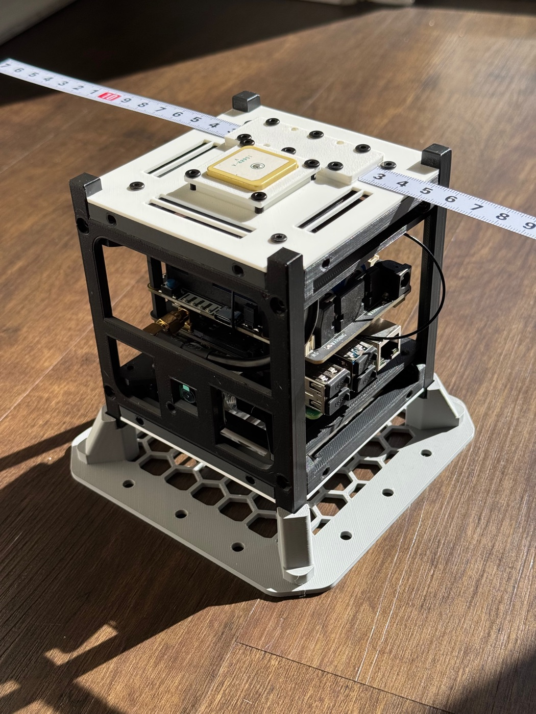
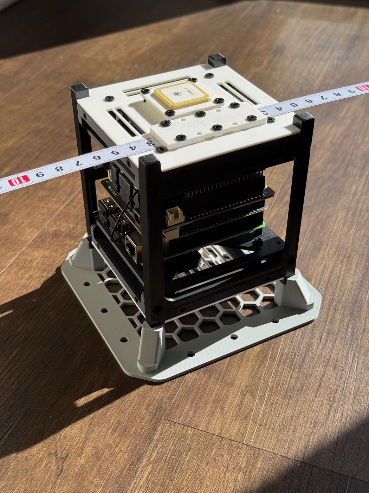
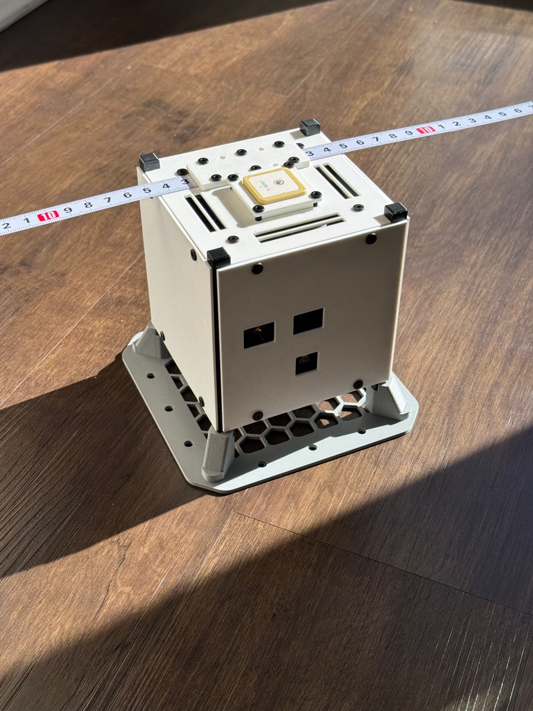
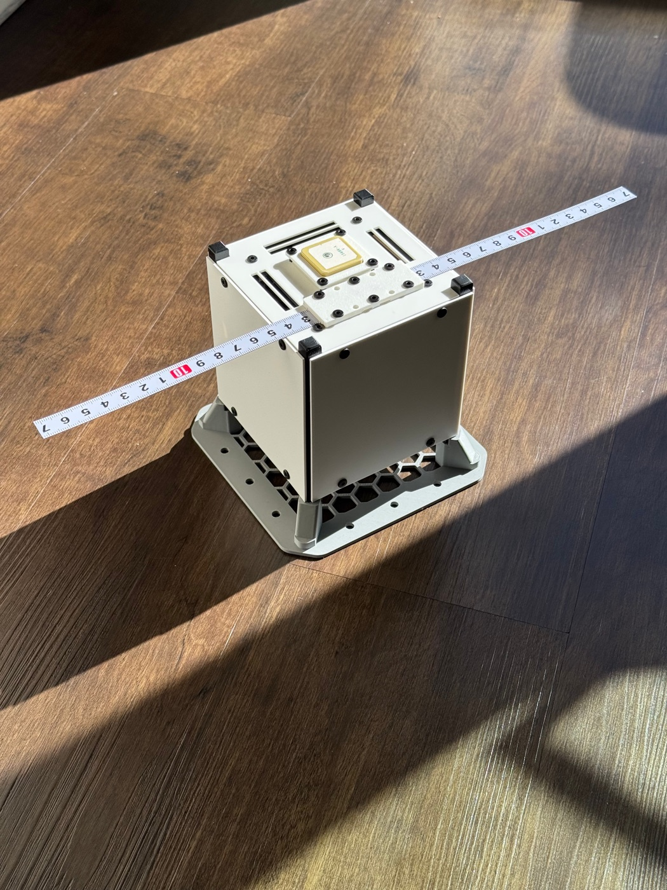
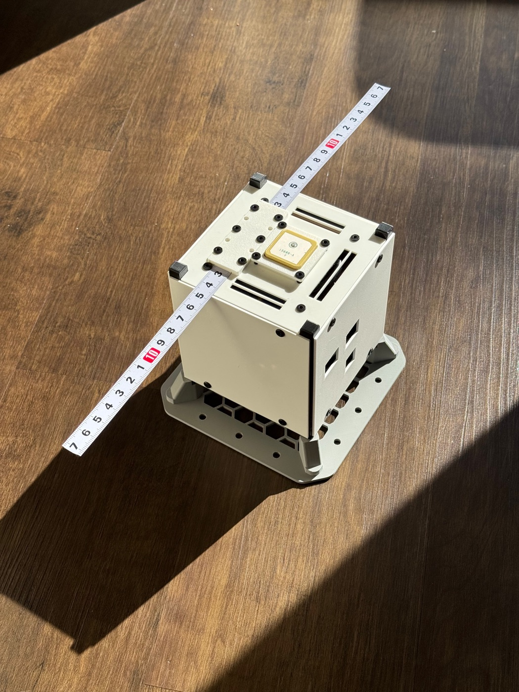

# CubeSat Sim

CubeSat Sim is a working flight software stack for a real, physical CubeSat — not just a simulation on paper. Five independent Python services (OBC, EPS, ADCS, Payload, COMMS) each model one satellite subsystem and talk to each other exclusively over MQTT, the same way modules communicate over a real spacecraft bus. A central state machine drives the mission lifecycle (`BOOT → DEPLOY → NOMINAL ↔ SCIENCE → LOW_POWER → SAFE`), reacting to live battery telemetry, IMU/GPS navigation data, and ground commands, while COMMS logs everything to SQLite (with automatic retention cleanup) and relays it to a [cloud ground station](https://github.com/miksrv/cubesat-groundstation) over HTTP API and/or a LoRa radio link, in real time.



It runs today on a Raspberry Pi inside a 3D-printed frame, wired to real sensors — battery fuel gauge, IMU, magnetometer, GPS, barometric/humidity sensors, and a camera. Everything needed to build one yourself is in this repo: the code, the [3D models](hardware/models), and the [hardware list](#hardware).

If you're learning satellite software architecture, distributed systems, or embedded Python, feel free to dig in, fork it, and adapt it to your own build. If it's useful to you, a star helps other people find it.

The platform can also be adapted for local development by mocking the hardware dependencies (see [Hardware](#hardware)).

---

## Table of Contents

- [Architecture Overview](#architecture-overview)
- [Subsystems](#subsystems)
  - [OBC — On-Board Computer](#obc--on-board-computer)
  - [EPS — Electrical Power System](#eps--electrical-power-system)
  - [ADCS — Attitude Determination and Control System](#adcs--attitude-determination-and-control-system)
  - [Payload](#payload)
  - [COMMS](#comms)
  - [Common Infrastructure](#common-infrastructure)
- [MQTT Topic Reference](#mqtt-topic-reference)
- [Message Payloads](#message-payloads)
- [Data Flows](#data-flows)
- [Directory Structure](#directory-structure)
- [Hardware](#hardware)
  - [New Components](#new-components)
  - [Mechanical / Fasteners](#mechanical--fasteners)
  - [3D Models](#3d-models)
  - [Build Photos](#build-photos)
- [Setup and Running](#setup-and-running)
- [Configuration](#configuration)
- [Logs](#logs)
- [Documentation](#documentation)
- [Related Projects](#related-projects)

---

## Architecture Overview

Each subsystem is an independent Python process. All inter-process communication happens over a local MQTT broker (mosquitto). No service calls another directly.

```
┌──────────────────────────────────────────────────────────────────┐
│                     MQTT Broker (mosquitto)                      │
│                                                                  │
│  cubesat/command            cubesat/obc/status      (retained)   │
│                             cubesat/eps/status      (retained)   │
│                             cubesat/adcs/status                  │
│                             cubesat/payload/status  (retained)   │
│                             cubesat/payload/data                 │
│                             cubesat/payload/photo                │
│                             cubesat/comms/data      (on-demand)  │
└───────────┬──────────────────────────────────────────────────────┘
            │ publish / subscribe
   ┌────────┴───────────────────────────────────────────────┐
   ▼            ▼           ▼             ▼                 ▼
┌──────┐    ┌──────┐    ┌───────┐    ┌───────────┐    ┌───────────┐
│ OBC  │    │ EPS  │    │ ADCS  │    │  Payload  │    │  COMMS    │
│      │    │      │    │       │    │           │    │           │
│State │    │Power │    │IMU/GPS│    │ Camera    │    │SQLite DB  │
│Mach. │    │Mon.  │    │ AHRS  │    │ Science   │    │API + LoRa │
└──────┘    └──────┘    └───────┘    └───────────┘    └───────────┘
               │           │              │                 │
            I2C/GPIO    I2C/UART      I2C / CSI            I2C
            MAX17048    QMI8658       LPS22HB           SC16IS752
            X728 UPS    AK09918       SHTC3            LoRa, 52Pi IoT
                        A9G GPS       Picamera2          Node(A)
                      Raspberry Pi Hardware
```

---

## Subsystems

### OBC — On-Board Computer

**Path:** `src/obc/` | **MQTT client ID:** `obc`

The central authority of the simulation. It is the only service that manages mission state. All other services react to `cubesat/obc/status` to know the current mission phase.

#### State Machine

```
         ┌──────────────────────────────────────────────────────┐
         │                  enter_safe_mode (any state)         │
         ▼                                                      │
       BOOT ──auto_deploy──► DEPLOY ──deployment_complete──► NOMINAL
                                                          │       ▲
                                             start_science│       │end_science
                                                          ▼       │
                                                       SCIENCE ───┘
                                                          │
                                        enter_low_power (battery < 40%)
                                                          ▼
                                                      LOW_POWER
                                                          │
                                          enter_safe_mode (battery < 20%)
                                                          ▼
                                                        SAFE
                                                          │
                                              recover (external power restored)
                                                          ▼
                                                       NOMINAL
```

**Transition rules** (implemented in `handlers.py`):

| Condition | Trigger | Result |
|-----------|---------|--------|
| Battery < 40% | EPS status message | → `LOW_POWER` (if not already `LOW_POWER` or `SAFE`) |
| Battery < 20% | EPS status message | → `SAFE` (from any state) |
| External power restored | EPS status message | → `NOMINAL` (from `LOW_POWER` or `SAFE`) |
| `science_start` command | Ground command | `NOMINAL` → `SCIENCE` |
| `science_stop` command | Ground command | `SCIENCE` → `NOMINAL` |
| `safe_mode` command | Ground command | any → `SAFE` |
| `recover` command | Ground command | `SAFE` → `NOMINAL` |

**Key files:**

| File | Responsibility |
|------|----------------|
| `main.py` | MQTT setup, heartbeat publish loop (30 s) |
| `state_machine.py` | `CubeSatStateMachine` — state definitions, transitions, state publishing |
| `handlers.py` | `OBCMessageHandlers` — EPS status reactions, ground command parsing |

---

### EPS — Electrical Power System

**Path:** `src/eps/` | **MQTT client ID:** `eps`

Reads battery state from the MAX17048 fuel gauge IC (I2C address `0x36`) and external power state from a GPIO pin connected to the X728 UPS Power Loss Detection (PLD) pin. Publishes status every 30 seconds with `retain=True`.

**Key files:**

| File | Responsibility |
|------|----------------|
| `main.py` | MQTT setup, publish loop (30 s) |
| `power_monitor.py` | `EPSMonitor` — MAX17048 I2C reads, GPIO external-power read |

---

### ADCS — Attitude Determination and Control System

**Path:** `src/adcs/` | **MQTT client ID:** `adcs`

Reads the QMI8658 IMU (accelerometer + gyroscope, I2C) and AK09918 magnetometer (I2C). Fuses the three sensor axes using a Mahony complementary filter to produce roll/pitch/yaw angles. Also reads GPS/BDS position from the A9G module (NMEA over UART, `/dev/ttySC1`) — orientation and position are both "where and how the satellite is" data, so they live in the same subsystem. Publishes at 2 Hz (every 500 ms); the `gps` sub-object reflects the last known fix and is not blocked on waiting for a new one (`fix: false` with stale/`null` values when there's no signal).

Note: this service is currently sensing-only. Actuator control (reaction wheels, magnetorquers) is not implemented.

**Key files:**

| File | Responsibility |
|------|----------------|
| `main.py` | MQTT setup, IMU + GPS poll loop (0.5 s) |
| `common/imu_qmi8658_ak09918.py` | `IMU` — QMI8658 + AK09918 I2C driver, Mahony AHRS |
| `common/gps_a9g.py` | `GPS` — A9G NMEA (GGA/RMC) reader over UART |

---

### Payload

**Path:** `src/payload/` | **MQTT client ID:** `payload`

Combines two responsibilities:

1. **Camera** — captures a JPEG photo via Picamera2 on demand. Responds to `take_photo`, `start_timelapse`, and `stop_timelapse` commands on `cubesat/command`. `take_photo` and `start_timelapse` are gated: only permitted when the OBC is in `NOMINAL` state. Photos are Base64-encoded and published to `cubesat/payload/photo`.

2. **Science** — polls an LPS22HB barometric pressure + temperature sensor (I2C) and a SHTC3 humidity + temperature sensor (I2C) every 60 seconds and publishes the readings to `cubesat/payload/data`.

**Key files:**

| File | Responsibility |
|------|----------------|
| `main.py` | MQTT wiring, OBC state tracking, command routing, science poll loop (60 s) |
| `camera.py` | `PayloadCamera` — Picamera2 integration, photo storage |
| `science.py` | `ScienceCollector` — LPS22HB + SHTC3 I2C reads with CRC verification |

---

### COMMS

**Path:** `src/comms/` | **MQTT client ID:** `comms`

The single point of contact with the ground — everything that isn't local MQTT goes through here, in both directions. Subscribes to all subsystem status topics and maintains an in-memory cache of the latest reading from each. Every `COMMS_LOOP_INTERVAL_SEC` (default 30s):

- If the cached OBC state is `SCIENCE` **and** the `aggregation_enabled` flag is on, assembles a packet from the cache plus system health metrics (CPU, RAM, disk, temperature) and writes it to SQLite. Rows older than `COMMS_DB_RETENTION_DAYS` (default 30) are purged periodically.
- If `api_enabled` is on **and** internet connectivity is confirmed (checked every loop iteration, not just once at startup — this channel is for ground/debug use, where connectivity comes and goes), POSTs the packet to `COMMS_API_URL` and polls the same API for any ground commands queued while the link was down.
- If `lora_enabled` is on, transmits the packet over LoRa (via the 52Pi IoT Node(A)'s SC16IS752 I2C↔UART bridge) and polls for an inbound LoRa packet.

**Dynamic channel control:** the three flags above (`api_enabled`, `lora_enabled`, `aggregation_enabled`) can be toggled at runtime with a `set_comms_config` ground command (see [Message Payloads](#message-payloads)) — sent directly to COMMS over any active channel, not routed through OBC. They are **not persisted**: a service restart always resets them to the `COMMS_API_ENABLED`/`COMMS_LORA_ENABLED`/`COMMS_AGGREGATION_ENABLED` env-var defaults.

**Inbound commands, unified:** whether a command arrives as a direct MQTT `cubesat/command` publish, is polled from the remote API's pending-commands queue, or is received over LoRa (CRC-16-CCITT checked), COMMS re-publishes it verbatim onto the local `cubesat/command` topic. OBC/Payload (and COMMS itself, for `get_telemetry`/`set_comms_config`) never need to know which physical channel a command came in on.

**Note:** COMMS does **not** publish to `cubesat/comms/data` on the periodic loop — that topic is only published in response to an on-demand `get_telemetry` command.

**SQLite schema** (`data/comms.db`, table `comms_log`):

| Column group | Fields |
|---|---|
| Timing | `id`, `timestamp` (ISO-8601 UTC string, e.g. `2026-03-11T14:30:00.123456Z` — not a Unix float, unlike the MQTT payloads below) |
| OBC | `obc_state` |
| EPS | `battery`, `voltage`, `external_power` |
| ADCS | `roll`, `pitch`, `yaw`, `imu_temp`, `accel_x/y/z`, `gyro_x/y/z` |
| Payload science | `temperature`, `humidity`, `pressure` |
| System health | `cpu_percent`, `ram_percent`, `swap_percent`, `disk_percent`, `uptime_seconds`, `cpu_temperature` |
| Raw | `raw_json` (full packet as JSON string) |

**Key files:**

| File | Responsibility |
|------|----------------|
| `main.py` | Entry point, logging setup |
| `service.py` | `CommsService` — subscriptions, data cache, packet assembly, SQLite writes + cleanup, remote API send/poll, LoRa TX/RX, main loop |
| `lora.py` | `LoRaModule` — SC16IS752 I2C register driver, CRC-16-CCITT framing |

---

### Common Infrastructure

**Path:** `src/common/`

Shared code imported by all services.

| File | Responsibility |
|------|----------------|
| `config.py` | All constants: MQTT broker, port, keepalive, all topic strings (`TOPICS` dict), data paths, COMMS intervals/flags |
| `mqtt_client.py` | `get_mqtt_client(client_id)` — MQTTv5 factory with exponential backoff reconnect |
| `logging_setup.py` | `setup_logging(service_name)` — rotating file handler (10 MB × 5 files) + console, writes to `/var/log/cubesat/` |
| `system_metrics.py` | `SystemMetricsCollector` — CPU / RAM / swap / disk / uptime / CPU temperature via `psutil` |
| `utils.py` | `crc16_ccitt()`, `json_dumps_pretty()`, `timestamp_iso()`, `ensure_dir()` |
| `imu_qmi8658_ak09918.py` | `IMU` class — QMI8658 + AK09918 I2C driver and Mahony AHRS (used by ADCS) |
| `gps_a9g.py` | `GPS` class — A9G NMEA reader over UART (used by ADCS) |

---

## MQTT Topic Reference

All topic strings are defined in `src/common/config.py` (`TOPICS` dict). Always import from there — never hardcode topic strings.

| `TOPICS` key | Topic string | Direction | Publisher | Subscribers |
|---|---|---|---|---|
| `command` | `cubesat/command` | Ground → All | Ground station, or COMMS (relaying LoRa/API-polled commands) | OBC, Payload, COMMS |
| `obc_status` | `cubesat/obc/status` | OBC → All | OBC | Payload, COMMS |
| `eps_status` | `cubesat/eps/status` | EPS → OBC, COMMS | EPS | OBC, COMMS |
| `adcs_status` | `cubesat/adcs/status` | ADCS → COMMS | ADCS | COMMS |
| `payload_status` | `cubesat/payload/status` | Payload → All | Payload | (ground tools) |
| `payload_data` | `cubesat/payload/data` | Payload → COMMS | Payload | COMMS |
| `payload_photo` | `cubesat/payload/photo` | Payload → Ground | Payload | (ground tools) |
| `comms_data` | `cubesat/comms/data` | COMMS → Ground | COMMS | (ground tools) |

`obc_status` and `eps_status` are published with `retain=True` so newly connected services immediately receive the last known state.

---

## Message Payloads

### `cubesat/obc/status`
```json
{
  "timestamp": 1741863600.0,
  "status": "NOMINAL"
}
```

### `cubesat/eps/status`
```json
{
  "timestamp": 1741863600.0,
  "battery": 87.5,
  "voltage": 4.123,
  "external_power": true
}
```

### `cubesat/adcs/status`
```json
{
  "timestamp": 1741863600.0,
  "roll": 1.23,
  "pitch": -0.45,
  "yaw": 178.9,
  "imu_temp": 34.5,
  "accel_g": {"x": 0.01, "y": 0.02, "z": 0.99},
  "gyro_dps": {"x": 0.1, "y": -0.2, "z": 0.05},
  "gps": {"lat": 55.7558, "lon": 37.6173, "alt": 156.2, "speed": 0.4, "fix": true}
}
```

### `cubesat/payload/status`
Published (retained) on connect, and again on a photo-processing error.
```json
{
  "state": "IDLE",
  "alive": true,
  "timestamp": 1741863600.0
}
```

### `cubesat/payload/data`
No timestamp field — COMMS timestamps data itself on ingest.
```json
{
  "temperature": 23.4,
  "humidity": 45.2,
  "pressure": 1013.25
}
```

### `cubesat/payload/photo` (success)
```json
{
  "request_id": "req_001",
  "status": "SUCCESS",
  "timestamp": 1741863600.0,
  "file": "photo_20260313_120000.jpg",
  "photo_base64": "<base64-encoded JPEG>"
}
```

### `cubesat/payload/photo` (error)
```json
{
  "request_id": "req_001",
  "status": "ERROR",
  "reason": "Photo capture not allowed: OBC status is 'SCIENCE'"
}
```

### Ground commands to `cubesat/command`

All commands use the same topic. The `"command"` field determines which service handles the message.

```json
{"command": "science_start"}
{"command": "science_stop"}
{"command": "safe_mode"}
{"command": "recover"}
{"command": "take_photo", "request_id": "req_001", "params": {"overlay": false}}
{"command": "start_timelapse", "params": {"interval_sec": 60}}
{"command": "stop_timelapse"}
{"command": "get_telemetry", "request_id": "req_002"}
{"command": "set_comms_config", "params": {"api_enabled": true, "lora_enabled": false, "aggregation_enabled": true}}
```

`set_comms_config` is handled by COMMS itself — any subset of `api_enabled`/`lora_enabled`/`aggregation_enabled` may be included; omitted keys are left unchanged. The update is in-memory only and does not survive a COMMS restart.

---

## Data Flows

### SCIENCE mode cycle

```
1. Ground sends:  {"command": "science_start"}  →  cubesat/command

2. OBC receives command, transitions NOMINAL → SCIENCE
   Publishes: {"timestamp": <unix_float>, "status": "SCIENCE"}  →  cubesat/obc/status  (retain)

3. Payload reads obc_state = "SCIENCE" — science poll continues as normal.
   Every 60 s: reads LPS22HB + SHTC3  →  cubesat/payload/data

4. ADCS: every 500 ms: reads QMI8658 + AK09918 (+ last known A9G GPS fix), runs AHRS  →  cubesat/adcs/status

5. EPS: every 30 s: reads MAX17048 + GPIO  →  cubesat/eps/status

6. COMMS: every COMMS_LOOP_INTERVAL_SEC (default 30 s), while obc_state == "SCIENCE" and aggregation_enabled:
   Merges cached OBC/EPS/ADCS/payload/system data → writes row to comms.db
   (does NOT publish to cubesat/comms/data on this loop — see note below)
   If api_enabled + internet reachable: also POSTs the same packet to the remote API and polls it for queued commands
   If lora_enabled: also transmits the same packet over LoRa and polls for an inbound LoRa packet

7. Ground sends:  {"command": "science_stop"}  →  cubesat/command
   OBC: SCIENCE → NOMINAL
```

> `cubesat/comms/data` is only published on-demand (step below) or, if `api_enabled`, forwarded to a remote HTTP API — see [COMMS](#comms).

### Photo request

```
1. Ground sends: {"command": "take_photo", "request_id": "req_001", "params": {"overlay": false}}  →  cubesat/command

2. Payload checks obc_state:
   - Not NOMINAL → publishes error  →  cubesat/payload/photo
   - NOMINAL     → captures JPEG via Picamera2
                   saves to data/photos/
                   Base64-encodes image

3. Publishes full response (with photo_base64)  →  cubesat/payload/photo
```

### On-demand telemetry request

```
1. Ground sends: {"command": "get_telemetry", "request_id": "req_002"}  →  cubesat/command

2. COMMS builds a packet from its in-memory cache (independent of OBC state and of the
   api_enabled/lora_enabled/aggregation_enabled flags)
   Attaches request_id to the packet

3. Publishes  →  cubesat/comms/data  (retained)
```

### Command via LoRa or remote API

```
1. Ground sends a command over LoRa, or queues it on the remote API's pending-commands endpoint

2. COMMS: next loop iteration —
   LoRa: polls the LoRa RX register, verifies the CRC-16-CCITT, decodes the JSON payload
   API:  polls .../api/cubesat/commands/pending (only while api_enabled + internet reachable)

3. COMMS re-publishes the command verbatim  →  cubesat/command
   (OBC/Payload/COMMS route it exactly as they would a command sent directly over MQTT)
```

### Timelapse

```
1. Ground sends: {"command": "start_timelapse", "params": {"interval_sec": 60}}  →  cubesat/command
   Payload: OBC must be NOMINAL; starts background thread capturing every interval_sec seconds.

2. Ground sends: {"command": "stop_timelapse"}  →  cubesat/command
   Payload: stops timelapse thread (allowed from any OBC state).
```

### Low-power event

```
1. EPS reads battery = 38%  →  cubesat/eps/status

2. OBC handler: 38% < 40% threshold → triggers enter_low_power
   State: NOMINAL → LOW_POWER
   Publishes: {"timestamp": <unix_float>, "status": "LOW_POWER"}  →  cubesat/obc/status

3. If battery continues to drop to 18%:
   OBC handler: 18% < 20% → triggers enter_safe_mode
   State: LOW_POWER → SAFE
   Publishes: {"timestamp": <unix_float>, "status": "SAFE"}  →  cubesat/obc/status

4. When external power is connected (GPIO pin HIGH):
   OBC handler: calls recover()
   State: SAFE → NOMINAL
```

---

## Directory Structure

```
cubesat-sim/
├── src/
│   ├── obc/                       # On-Board Computer — state machine + handlers
│   │   ├── __init__.py
│   │   ├── main.py                # Service entry point, MQTT setup, heartbeat loop
│   │   ├── state_machine.py       # CubeSatStateMachine using `transitions` library
│   │   └── handlers.py            # OBCMessageHandlers — EPS reactions, ground commands
│   │
│   ├── eps/                       # Electrical Power System
│   │   ├── __init__.py
│   │   ├── main.py                # Service entry point, 30 s publish loop
│   │   └── power_monitor.py       # EPSMonitor — MAX17048 I2C + X728 GPIO reads
│   │
│   ├── adcs/                      # Attitude Determination and Control
│   │   ├── __init__.py
│   │   └── main.py                # Service entry point, 500 ms IMU + GPS poll loop
│   │
│   ├── payload/                   # Camera + science sensors
│   │   ├── __init__.py
│   │   ├── main.py                # Service entry point, command router, science poll loop
│   │   ├── camera.py              # PayloadCamera — Picamera2, photo storage
│   │   └── science.py             # ScienceCollector — LPS22HB + SHTC3 I2C reads
│   │
│   ├── comms/                     # Ground link: SQLite aggregation, remote API, LoRa
│   │   ├── __init__.py
│   │   ├── main.py                # Service entry point
│   │   ├── service.py             # CommsService — cache, packet builder, SQLite, API, LoRa
│   │   └── lora.py                # LoRaModule — SC16IS752 I2C driver, CRC-16-CCITT framing
│   │
│   └── common/                    # Shared code used by all services
│       ├── __init__.py
│       ├── config.py              # All constants: broker, ports, TOPICS dict, paths
│       ├── mqtt_client.py         # get_mqtt_client() factory — MQTTv5 + reconnect
│       ├── logging_setup.py       # setup_logging() — rotating file + console handler
│       ├── system_metrics.py      # SystemMetricsCollector — CPU/RAM/disk/temp
│       ├── utils.py               # crc16_ccitt, json_dumps_pretty, timestamp_iso
│       ├── imu_qmi8658_ak09918.py # IMU driver + Mahony AHRS (used by ADCS)
│       └── gps_a9g.py             # GPS driver — A9G NMEA over UART (used by ADCS)
│
├── systemd/                       # systemd unit files
│   ├── cubesat-obc.service
│   ├── cubesat-eps.service
│   ├── cubesat-adcs.service
│   ├── cubesat-payload.service
│   └── cubesat-comms.service
│
├── scripts/
│   ├── install.sh                 # Create venv, install deps, install + start systemd units
│   ├── start.sh                   # Start and enable all services
│   ├── stop.sh                    # Stop and disable all services
│   └── restart.sh                 # Restart all services (e.g. after a system update)
│
├── config/
│   └── config.yaml                # Runtime defaults: MQTT, COMMS/GPS settings, camera resolution
│
├── hardware/                      # Physical build assets (not runtime data)
│   ├── models/                    # 3D-printable/CAD files for the frame and mounts
│   └── photos/                    # Build/assembly photos embedded in this README
│
├── data/                          # Runtime data (created on first run)
│   ├── photos/                    # JPEG files from payload camera
│   └── comms.db                   # SQLite database (comms_log table)
│
├── docs/
│   ├── architecture.md            # Detailed architecture reference
│   ├── code_smells.md             # Known issues and technical debt
│   └── refactoring_plan.md        # Prioritised improvement plan with code examples
│
├── ROADMAP.md                     # Feature tracker and improvement backlog
├── CLAUDE.md                      # AI assistant context for this repo
├── requirements.txt
└── README.md
```

---

## Hardware

The simulation targets Raspberry Pi. The following hardware is required for full operation.

**Components** — Raspberry Pi, Pi Camera, 2× 18650 batteries, Sense HAT, etc.



| Component | Purpose | Interface / Library | Product link | Documentation |
|---|---|---|---|---|
| Raspberry Pi 4 Model B | Main compute — hosts and runs all five services | — | [Raspberry Pi](https://www.raspberrypi.com/products/raspberry-pi-4-model-b/) | [Raspberry Pi Docs](https://www.raspberrypi.com/documentation/) |
| [X728 V2.5 UPS HAT](docs/hardware-x728-ups-hat.md) | Battery power management: LiPo fuel gauge (MAX17048) + AC-loss detection (PLD pin) — used by EPS | I2C (`0x36`) + GPIO · `smbus2`, `RPi.GPIO` | [AliExpress](https://www.aliexpress.us/item/3256804825472151.html) | [Geekworm Wiki](https://wiki.geekworm.com/X728) |
| ~~[Sense HAT (C)](docs/hardware-sense-hat-c.md)~~ | ~~Environmental/orientation sensor HAT: QMI8658 (accel + gyro) + AK09918 (magnetometer) drive ADCS orientation; LPS22HB (pressure) + SHTC3 (humidity) feed Payload science data~~ | ~~I2C · `smbus2`, `lgpio`~~ | ~~[AliExpress](https://www.aliexpress.us/item/3256811354242582.html)~~ | ~~[Waveshare Wiki](<https://www.waveshare.com/wiki/Sense_HAT_(C)>)~~ |
| [Raspberry Pi Camera Module V2 (8MP, 1080p)](docs/hardware-camera-module-v2.md) | Photo capture + timelapse — used by Payload | CSI · `picamera2` | [Amazon](https://a.co/d/02oyeWg8) | [Raspberry Pi Docs](https://www.raspberrypi.com/documentation/accessories/camera.html#camera-module-2) |
| ~~[IoT Node(A) — 52Pi Docker Pi Series (GSM/GPS/LoRa)](docs/hardware-iot-node-a-52pi.md)~~ | ~~Onboard GSM/GPS/LoRa module (A9G): GPS/BDS position feeds ADCS, LoRa (via the SC16IS752 I2C↔UART bridge) is COMMS' radio ground link alongside its HTTP API~~ | ~~UART (GPS) + I2C (LoRa) · `pyserial`, `pynmea2`, `smbus2`~~ | ~~[AliExpress](https://www.aliexpress.us/item/2251832864586218.html)~~ | ~~[52Pi Wiki](https://wiki.52pi.com/index.php?title=EP-0105)~~ |

> Also requires a `mosquitto` MQTT broker running on the Pi (software, not hardware) — see [Prerequisites](#prerequisites).

> **Non-Pi development:** All hardware libraries are imported at module level, so services will fail to import on a non-Raspberry Pi machine. Hardware mocking is on the roadmap (see `ROADMAP.md` items H1–H7).

### New Components

| Component | Power | Interface | Cost | Order Link |
|---|---|---|---|---|
| IO Expansion HAT for Raspberry Pi 5 / 4B / 3B+ (DFR0566) | 5V (3.3V/5V sensor rails, 6–12V for PWM) | Gravity — I2C, UART, SPI, IIS, digital, analog, PWM | $9.90 | [DFRobot](https://www.dfrobot.com/product-1930.html) |
| Gravity 4Pin I2C/UART Sensor Cable (10PCS) | — | Gravity PH2.0-4P ↔ XH2.54 DuPont | $6.00 | [DFRobot](https://www.dfrobot.com/product-1581.html) |
| Gravity: 10 DOF IMU AHRS BNO055 + BMP280 | 3.3–5V, 5mA | Gravity-I2C | $25.90 | [DFRobot](https://www.dfrobot.com/product-1793.html) |
| Gravity SEN0501 — High Accuracy Temperature, Humidity, Pressure, Ambient Light and UV Sensor | 3.3–5V, ~4mA | Gravity — I2C/UART | $29.90 | [DFRobot](https://www.dfrobot.com/product-2528.html) |
| Gravity: GNSS GPS BeiDou Receiver Module (TEL0157) | 3.3–5.5V, 40mA | Gravity — I2C/UART, IPEX1 antenna | $17.90 | [DFRobot](https://www.dfrobot.com/product-2651.html) |

### Mechanical / Fasteners

Used to assemble the 3D-printed frame ([`hardware/models/`](hardware/models/)) and mount the boards to it.

| Component | Product link |
|---|---|
| M3 Nuts | https://www.aliexpress.us/item/2255800416538696.html |
| M3 Screws | https://www.aliexpress.us/item/3256805798104626.html |
| M3 Standoffs | https://www.aliexpress.us/item/2251832676215215.html |

### 3D Models

3D-printable STL files for the physical build live in [`hardware/models/`](hardware/models/) (see that folder's README for file conventions):

| File | Purpose |
|---|---|
| `CUBESAT.blend` | Full 3D assembly of the satellite in Blender, organized into layers (frame, mounts, electronics stack, etc.) |
| `base/CS_MGSE_Tight_Fit.stl` | Ground support stand — holds the assembled CubeSat upright on a bench |
| `frame/Cubesat_Bottom_Frame.stl` | Bottom frame panel |
| `frame/Cubesat_Side_Frame_Plain.stl` | Side frame panel |
| `frame/Cubesat_Adaptor_Mount.stl` | Internal adaptor mount for the electronics stack |
| `frame/Cubesat_RaspbiCam_Frame.stl` | Camera mount for the Raspberry Pi Camera Module |

### Build Photos

Photos of the physical build (full-resolution originals are not kept in the repo — see [`hardware/photos/`](hardware/photos/) for naming conventions).

**3D-printed frame**



**Assembled — without side panels**

<p align="center">
  
  
  
</p>

**Finished unit — with protective panels**

<p align="center">
  
  
  
</p>

---

## Setup and Running

### Prerequisites

- Raspberry Pi running Raspberry Pi OS
- `mosquitto` MQTT broker installed and running (`sudo apt install mosquitto`)
- Python 3.9+

### Install dependencies and start as systemd services (recommended)

```bash
git clone <repo-url> /home/mik/cubesat-sim
cd /home/mik/cubesat-sim
bash scripts/install.sh
```

`install.sh` creates a virtualenv at `./venv`, installs `requirements.txt`, copies the unit files to `/etc/systemd/system/`, and starts the services.

### Manage services

```bash
bash scripts/start.sh    # start and enable all services
bash scripts/stop.sh     # stop and disable all services
bash scripts/restart.sh  # restart all services (e.g. after a system update)
```

### Run services manually (development)

Each service must be launched from the **project root** so that `src` is importable as a package:

```bash
source venv/bin/activate

PYTHONPATH=. python -m src.obc.main
PYTHONPATH=. python -m src.eps.main
PYTHONPATH=. python -m src.adcs.main
PYTHONPATH=. python -m src.payload.main
PYTHONPATH=. python -m src.comms.main
```

Run each in a separate terminal or as a background process.

---

## Configuration

Non-secret defaults live in [`config/config.yaml`](config/config.yaml). `src/common/config.py` loads that file first, then lets specific environment variables (or a `.env` file in the project root) override individual values. Secrets and deployment-specific values (remote API URL/key) are environment-variable only and must never be committed to `config.yaml`.

```yaml
# config/config.yaml
mqtt:
  broker: localhost       # overridden by MQTT_BROKER env var
  port: 1883              # overridden by MQTT_PORT env var
  keepalive: 60

comms:
  loop_interval_sec: 30    # overridden by COMMS_LOOP_INTERVAL_SEC env var
  db_retention_days: 30    # overridden by COMMS_DB_RETENTION_DAYS env var
  lora_i2c_address: 0x16   # overridden by LORA_I2C_ADDRESS env var

gps:
  port: /dev/ttySC1        # overridden by GPS_PORT env var
  baudrate: 9600           # overridden by GPS_BAUDRATE env var

camera:
  resolution: [1920, 1080]     # JPEG capture resolution [width, height]

logging:
  level: INFO                  # not currently read — each service hardcodes INFO in its main.py
```

Create a `.env` file to override the environment-variable settings:

```ini
# MQTT broker (overrides config.yaml)
MQTT_BROKER=localhost
MQTT_PORT=1883

# COMMS channel defaults at startup — a `set_comms_config` ground command can
# flip these at runtime, but they are NOT persisted; a restart resets to these.
COMMS_API_ENABLED=1
COMMS_LORA_ENABLED=0   # off by default — see ROADMAP.md, bench-test before enabling
COMMS_AGGREGATION_ENABLED=1

# Remote COMMS API (used only while api_enabled and internet is reachable)
COMMS_API_URL=http://localhost:8080
COMMS_API_KEY=your-api-key-here
```

| Variable | Default | Description |
|----------|---------|-------------|
| `MQTT_BROKER` | `localhost` (from `config.yaml`) | Hostname or IP of the MQTT broker |
| `MQTT_PORT` | `1883` (from `config.yaml`) | MQTT broker port |
| `COMMS_API_ENABLED` | `1` | Startup default for the `api_enabled` flag — POST COMMS packets to the remote API and poll it for queued commands |
| `COMMS_LORA_ENABLED` | `0` | Startup default for the `lora_enabled` flag — TX/RX over the 52Pi IoT Node(A) LoRa radio. Defaults off: the register-level protocol in `comms/lora.py` is unverified against real hardware — see [ROADMAP.md](ROADMAP.md) |
| `COMMS_AGGREGATION_ENABLED` | `1` | Startup default for the `aggregation_enabled` flag — write to `comms.db` while OBC state is `SCIENCE` |
| `COMMS_LOOP_INTERVAL_SEC` | `30` (from `config.yaml`'s `comms.loop_interval_sec`) | Sleep interval of the COMMS main loop — governs SQLite writes, remote API send/poll, and LoRa TX/RX alike |
| `COMMS_API_URL` | `http://localhost:8080` | Base URL of the remote COMMS server |
| `COMMS_API_KEY` | _(none)_ | API key sent as the `X-API-Key` header; if unset, remote sending is skipped even when enabled |
| `GPS_PORT` | `/dev/ttySC1` (from `config.yaml`'s `gps.port`) | Serial device for the A9G GPS/BDS NMEA UART |
| `GPS_BAUDRATE` | `9600` (from `config.yaml`'s `gps.baudrate`) | Baud rate for the GPS UART |

> **Known gap:** `logging.level` is defined in `config.yaml` and exposed as a constant in `config.py`, but no service currently reads it — log level is hardcoded to `INFO` per-service. Don't rely on editing that `config.yaml` key to change behavior yet. (The previous version of this gap — the telemetry loop interval not actually reading its own `config.yaml` value — is fixed: `COMMS_LOOP_INTERVAL_SEC` now reads `comms.loop_interval_sec` as its default.)

---

## Logs

Each service writes rotating logs to `/var/log/cubesat/<service>.log` (10 MB per file, 5 files retained). When running as systemd units, logs are also available via `journalctl`:

```bash
journalctl -u cubesat-obc.service -f
journalctl -u cubesat-eps.service -f
journalctl -u cubesat-adcs.service -f
journalctl -u cubesat-payload.service -f
journalctl -u cubesat-comms.service -f
```

---

## Documentation

| Document | Description |
|----------|-------------|
| [docs/architecture.md](docs/architecture.md) | Detailed runtime architecture, subsystem internals, data flow diagrams |
| [docs/code_smells.md](docs/code_smells.md) | Historical catalogue of bugs/tech debt found during the initial audit — most items (B1–B6, C1–C5, R1–R4) are already fixed; check [ROADMAP.md](ROADMAP.md#completed) for current status before acting on it |
| [docs/refactoring_plan.md](docs/refactoring_plan.md) | Prioritised refactoring plan with implementation examples (HAL and tests, H1–H7/T1–T7, are still pending) |
| [ROADMAP.md](ROADMAP.md) | Feature tracker: bugs, improvements, new features |

---

## Related Projects

| Project | Description |
|---|---|
| [cubesat-groundstation](https://github.com/miksrv/cubesat-groundstation) | Cloud ground station (PHP/CodeIgniter 4 backend + React dashboard) that receives COMMS packets POSTed by this project's `CommsService` (see [COMMS](#comms) and [Configuration](#configuration)), stores them in MySQL, and visualizes them in real time. Also expected to expose a pending-commands queue for COMMS to poll — see the note in [COMMS](#comms) about that contract not being implemented there yet |

---

## License

See `LICENSE` for details.
